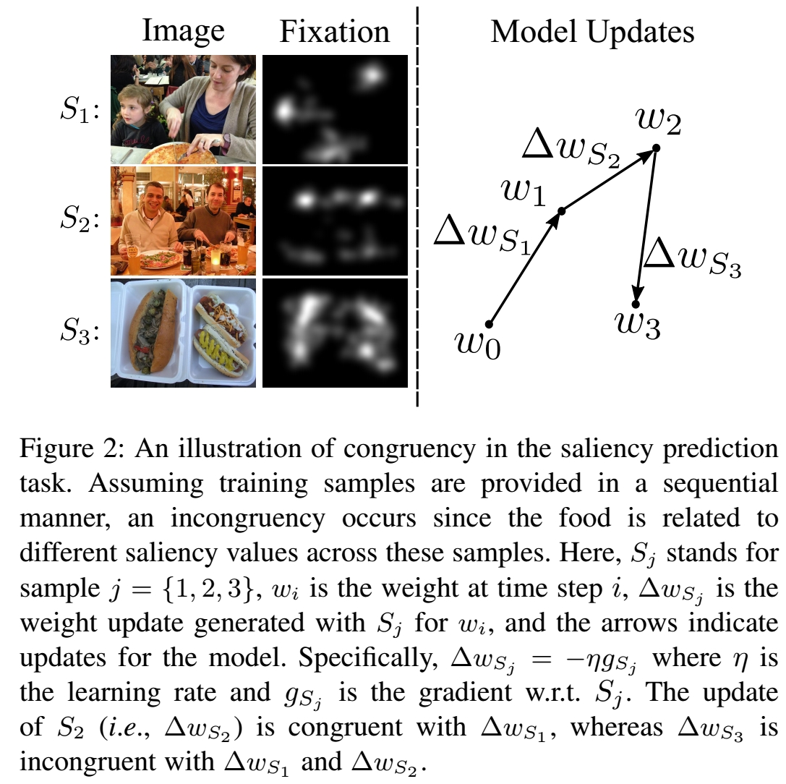
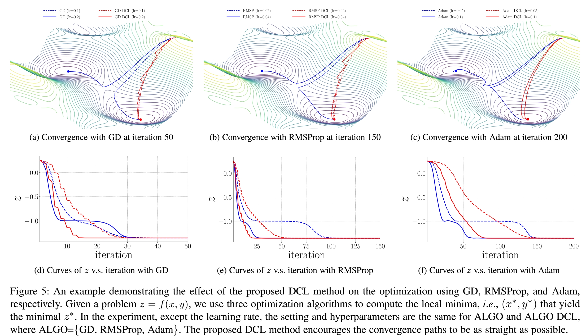

# Direction Concentration Learning: Enhancing Congruency in Machine Learning
<p align="center">
  <b>Luo, Yan and Wong, Yongkang and Kankanhalli, Mohan S and Zhao, Qi</b></span>
</p>

This repository contains the code for DCL in the **classification** task. For the continual learning task, please refer to repository [congruency_continual](https://github.com/luoyan407/congruency_continual).<br/>
DCL is a work that studies the agreement between the learned knowledge and the new information in a learning process. The code is built on PyTorch, and partly based on [GEM](https://github.com/facebookresearch/GradientEpisodicMemory). It is tested under Ubuntu 1604 LTS with Python 3.6.
<p align="center">

</p>

# TOC
1. [Prerequisites](#prerequisites)
2. [Illustration](#illustration)
3. [Training on ImageNet](#training-on-imagenet)
4. [Training on Tiny ImageNet](#training-on-tiny-imagenet)
5. [Training on CIFAR](#training-on-cifar)
6. [Pretrained Model](#pretrained-model)
7. [Citation](#citation)


## Prerequisites
1. [PyTorch 0.4.1](https://pytorch.org/get-started/previous-versions/), e.g.,
```bash
conda install pytorch=0.4.1 cuda80 -c pytorch # for CUDA 8.0
conda install pytorch=0.4.1 cuda90 -c pytorch # for CUDA 9.0
```
To use [EfficientNet](https://github.com/lukemelas/EfficientNet-PyTorch) as the baseline model, it requires [PyTorch 1.1.0+](https://pytorch.org/), e.g., 
```bash
conda install pytorch==1.1.0 torchvision==0.3.0 cudatoolkit=10.0 -c pytorch
```
2. [torchvision 0.2.1+](http://deepmind.github.io/torch-distributions/), e.g.,
```bash
pip install torchvision==0.2.1
```
3. [quadprog](https://pypi.org/project/quadprog/), i.e.,
```bash
pip install msgpack
pip install Cython
pip install quadprog
```
4. [TensorboardX](https://pypi.org/project/tensorboardX/) (optinal)
```bash
pip install tensorboardX==1.2
```

## Illustration
<p align="center">

</p>
To plot the convergence paths and the corresponding z-vs-iteration curves, execute the following commands  

```bash  
# go to the illustrator folder
cd illustrator 
# generate convergence path with one of optimizers (gd, rmsprop, or adam)
python convergence_visualization.py --opt gd|rmsprop|adam
# generate the corresponding z-vs-iteration curves
plot plot_z.py
```


## Training on ImageNet
Step 1: Download [ImageNet](http://www.image-net.org/)  
The directory structure of the validation set should be re-organized as follows, i.e.,
```
imagenet/images
├── train
│   ├── n01440764
│   ├── n01443537
│   ├── n01484850
│   ├── n01491361
│   ├── n01494475
│   ...
└── val
    ├── n01440764
    ├── n01443537
    ├── n01484850
    ├── n01491361
    ├── n01494475
    ...
```
Either you can write your own script to achive that, or use the [script](https://github.com/tensorflow/models/blob/master/research/slim/datasets/preprocess_imagenet_validation_data.py) provided in TensorFlow repo to do it.  
Step 2: We use 8 GPUs to train the models on ImageNet. To train ResNet-50 with DCL, run  
```bash
python -W ignore train_imgnet.py \
    -a resnet50 \
    --lr 0.1 \
    --lr-decay-epoch 30 \
    -b 512 \
    --epochs 90 \
    --n-classes 1000 \
    --workers 16 \
    --checkpoint-path 'checkpoints/imagenet/resnet50_dcl_1_1' \
    --mtype 'dcl' \
    --dcl-refsize 1 \
    --dcl-window 1 \
    '/path-to-folder/imagenet/images/'
```
To train ResNet-50 (baseline), run  
```bash
python -W ignore train_imgnet.py \
    -a resnet50 \
    --lr 0.1 \
    --lr-decay-epoch 30 \
    -b 512 \
    --epochs 90 \
    --n-classes 1000 \
    --workers 16 \
    --checkpoint-path 'checkpoints/imagenet/resnet50_baseline' \
    --mtype 'baseline' \
    '/path-to-folder/imagenet/images/'
```
To train ResNet-50 with GEM, run  
```bash
python -W ignore train_imgnet.py \
    -a resnet50 \
    --lr 0.1 \
    --lr-decay-epoch 30 \
    -b 512 \
    --epochs 90 \
    --n-classes 1000 \
    --workers 16 \
    --checkpoint-path 'checkpoints/imagenet/resnet50_gem_1' \
    --mtype 'gem' \
    --gem-memsize 1 \
    '/path-to-folder/imagenet/images/'
```
The above commands are written in [train_imgnet.sh](train_imgnet.sh) as well. 

## Training on Tiny ImageNet
Step 1: Download [Tiny ImageNet](https://tiny-imagenet.herokuapp.com/)  
The directory structure of the dataset should be re-organized as 
```
/home/yluo/project/dataset/tinyimagenet
├── images
│   ├── test
│   ├── train
│   └── val
├── wnids.txt
└── words.txt
```
Step 2: For training, please refer to [train_timgnet.sh](train_timgnet.sh).

## Training on CIFAR
The code for CIFAR experiment is built on [pytorch-classification](https://github.com/bearpaw/pytorch-classification)  
For training, please refer to [train_cifar.sh](train_cifar.sh).

## Pretrained Model
### ImageNet
The pre-trained model with DCL on ImageNet is available at a shared [Google drive](https://drive.google.com/open?id=1o5PSCQhoP9urM82dEQV0uwWCw1cOPblM). In this folder, the statistics including 1-crop top 1 validation accuracies along epochs are recorded in the file named *stat.csv*. Specifically, the highest val accuracy is **75.93%** at epoch 86, while the mean accuracy of the baseline over 3 runs is 75.66%.  
To load this pre-trained model, please first download the pre-trained model *model_best.pth.tar* to the created folder *data* and then run
```bash
python load_pretrained.py
```
### Tiny ImageNet
The pre-trained model with DCL on Tiny ImageNet is available at a shared [Google drive](https://drive.google.com/open?id=1RLyQIcJ8qNqds9US-Oo2a0uQEL0t6kSZ). The lowest val top-1 error is **16.89%** while the one of the baseline is 17.34%.
### CIFAR
The pre-trained models with DCL on CIFAR-10 and CIFAR-100 are available at the shared [Google drive](https://drive.google.com/open?id=1PxwiR29DLIsq4CYq9YS6pEjD239gS0XG) and the shared [Google drive](https://drive.google.com/open?id=1upor9Yv_DF5KWdhbdVg3AQCbze7pEwlr), respectively. The lowest val error on CIFAR-10 is **3.33%** while the one of the baseline is 3.53%. The lowest val error on CIFAR-100 is **17.02%** while the one of the baseline is 17.30%.

## Citation
If you find this work or the code useful in your research, please consider citing:

	@article{Luo_DCL_2019,
	  title={Direction Concentration Learning: Enhancing Congruency in Machine Learning},
	  author={Luo, Yan and Wong, Yongkang and Kankanhalli, Mohan S and Zhao, Qi}
	}


## Contact
luoxx648 at umn.edu   
Any discussions, suggestions, and questions are welcome!
